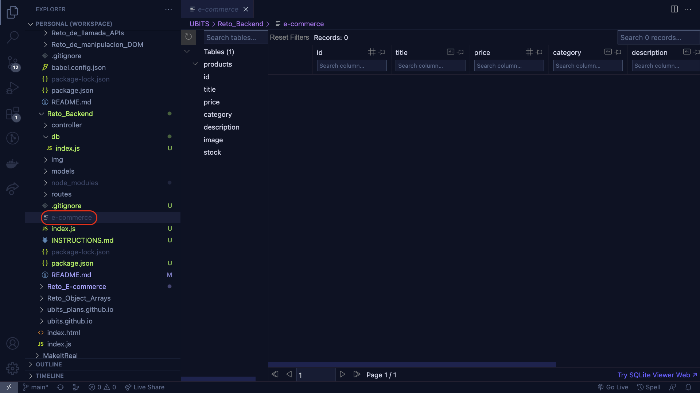
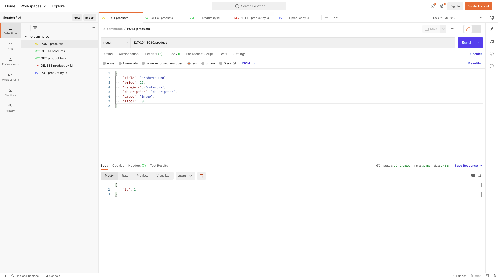
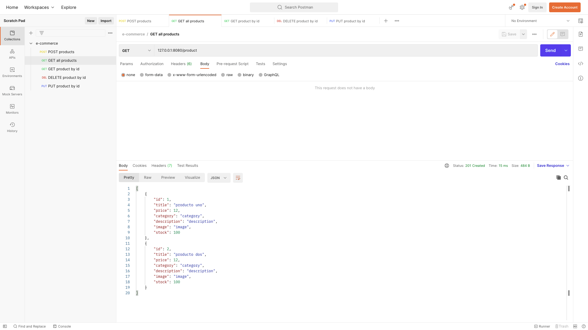
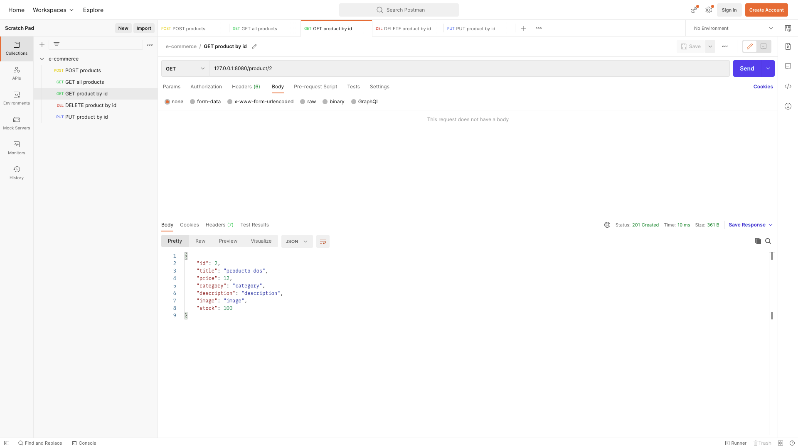
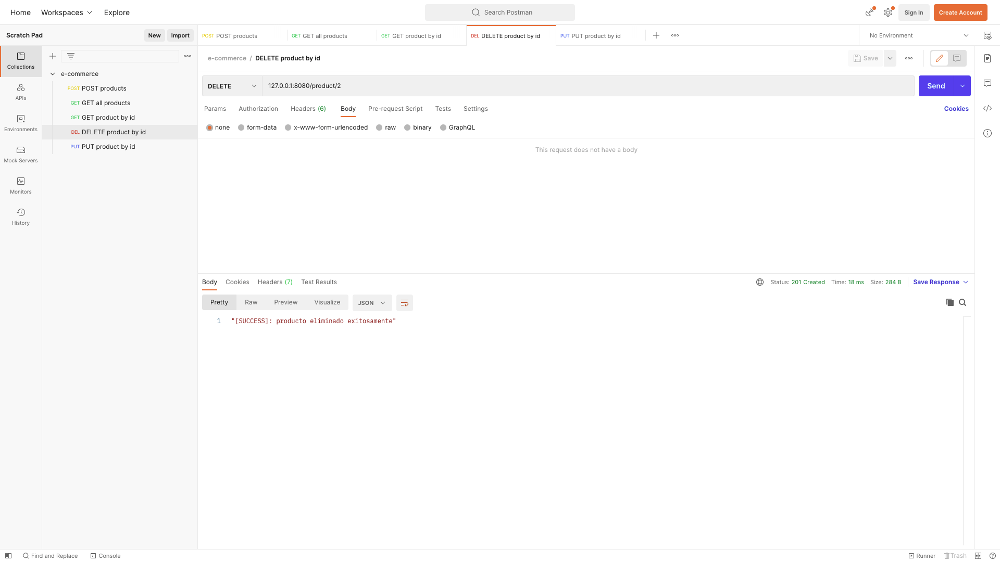
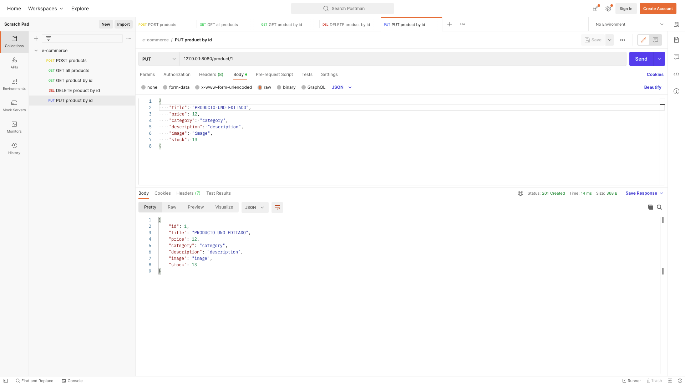

# 🤓 Reto UBITS

## Parte 1: configuración del servidor

primera realizaremos las configuraciones necesarias en nuestro archivo `index.js` para tener nuestro servidor corriendo en el puerto **8080**.

1. Para iniciar nuestro reto debemos realizar la configuración de un middleware que nos permita enviar y recibir información en el formato universalmente usado JSON, por favor agregar el middleware necesario.

2. Ahora configura el puerto `PORT` dado para que nuestro API reciba y envíe peticiones por dicho puerto recuerda inyectar una función callback que imprima en consola que el puerto en el cual el servicio está recibiendo peticiones.

## Parte 2: configuración de la base de datos

el siguiente paso en el desarrollo de nuestro backend API, es la creación de nuestra base de datos, para esto debemos dirigirnos a la carpeta **db** dentro de esta carpeta encontraras el archivo `index.js` ahora dentro de este archivo realiza:

1. utilizando el método `run` de la instancia creada **db** genera una tabla llamada productos con los siguientes parámetros:

```js
{
id: INTEGER PRIMARY KEY AUTOINCREMENT,
title: TEXT,
price: INT,
category: TEXT,
description: TEXT,
image: TEXT,
stock: INT
}
```

### Nota:

luego de realizada esta accion el root de nuestro proyecto veremos un archivo llamado `e-commerce` que actuara como nuestra base de datos, para ver correctamente esta base de datos te recomiendo que instales en en visual studio code, la extension [SQLite Viewer](https://marketplace.visualstudio.com/items?itemName=qwtel.sqlite-viewer) y de esta manera podremos ver correctamente la base de datos generada, debes ver algo similar a lo que se muestra en la siguiente imagen

<p align="center">

</p>

2. Ahora se debe modificar nuestra `QUERY` de tal manera que solo se cree la tabla del punto uno si aún no existe de esta manera evitaremos errores al momento de realizar algún cambio en nuestro proyecto o si el servidor se reinicia y trata de crear la tabla nuevamente.

## Parte 3: creación de los modelos para el CRUD

el siguiente paso será entonces crear los modelos que serán usados por los controladores para la ejecución de nuestro CRUD, para el desarrollo de este proyecto seguiremos un modelo estructural denominado **MVP: modelo, vista, controlador** De tal manera que los modelos de nuestro proyecto se deben crear en el folder `models` encontrarás un archivo denominado `models.js` en cual debes crear los siguientes modelos.

1. dentro de la función `createProduct` utiliza el método `.run` de `sqlite3` para crear un producto nuevo, recuerda que dicha función espera 3 parámetros la query que será ejecutada, el arreglo de valores a introducir en la query y una función callback que será ejecutada una vez termine de manera exitoso o fallido.
2. dentro de la función `getAllProducts` utiliza el método `.all` de `sqlite3` para obtener todos los productos de la tabla `products`, ten en cuenta que dicho método espera dos parámetros, el primero es la query que llama a todos los productos y el segundo una función callback que se ejecuta una vez se complete el request, retornando la data solicitada o un mensaje en caso de error en la ejecución del query.
3. dentro de la función `getProduct` utiliza el método `.get` de `sqlite3` para obtener un producto dado un `id`, ten en cuenta que dicho método espera 3 parámetros la query que será ejecutada, el arreglo de valores a introducir en la query y una función callback que será ejecutada una vez termine de manera exitoso o fallido, retornando la data solicitada o un mensaje en caso de error en la ejecución del query.
4. dentro de la función `deleteProduct` utiliza el método `.run` de `sqlite3` para eliminar un producto dado un `id`, ten en cuenta que dicho método espera 3 parámetros la query que será ejecutada, el arreglo de valores a introducir en la query y una función callback que será ejecutada una vez termine de manera exitoso o fallido, en la función callback retorna el error o un mensaje de eliminación completa.
5. por último dentro de la función `updateProduct` utiliza el método `.each` de `sqlite3` para obtener y modificar un producto dado el `id` y la información que vamos a actualizar del producto, ten en cuenta que dicho método espera 3 parámetros la query que será ejecutada, el arreglo de valores a introducir en la query y una función callback que será ejecutada una vez termine de manera exitoso o fallido.

- **5.1:** al terminar la query para actualizar la información del producto retornar el producto con toda la información actualizada para esto puedes utilizar el método `.get` de `sqlite3`.

## Parte 4: creación de los controladores para el CRUD

Los controladores son componentes esenciales que actúan como intermediarios entre la vista (interfaz de usuario) y el modelo (datos y lógica de la aplicación). Su función principal es manejar las solicitudes del usuario y coordinar la interacción entre la vista y el modelo. Este será el siguiente paso en el desarrollo de nuestro servicio backend de tal manera crea un controlador por cada uno de los modelos creados en el paso anterior, esto en el folder `controllers` en el archivo controllers.js

1. crea una función `create` que reciba como parámetros el request y response de una petición, luego utilice el modelo `createProduct` para crear un nuevo producto en la base de datos y retornar el **id** del nuevo producto con un código **200** y un código **500** si ocurrió un error en la creación del producto, al momento de utilizar el modelo `createProduct` recuerda que dicho modelo espera dos parámetros uno es la información del producto nuevo la cual va a venir del `request` de la petición y función callback donde realizaremos la respuesta de nuestro controlador.

2. crea una función `getAll` que reciba como parámetros el request y response de una petición, luego utilice el modelo `getAllProducts` para llamar todos los productos de la base de datos y retornarlos con un código **200** en caso que la consulta sea exitosa y un código **500** Si ocurre un error en la consulta de los productos, al momento de utilizar el modelo `getAllProducts` ten en cuenta que estamos usando funciones callback para obtener el resultado de la consulta.

3. crea una función `getById` que reciba como parámetros el request y response de una petición, luego utilice el modelo `getProduct` para obtener la información del producto con **id** en la base de datos y retornar un objeto con la información de dicho producto con un código **200** y un código **500** si ocurrió un error en la consulta del producto, al momento de utilizar el modelo `getProduct` recuerda que dicho modelo espera dos parámetros uno es el **id** del producto que se va a consultar en la DB la cual va a venir en los **params** del `request` y función callback donde realizaremos la respuesta de nuestro controlador.

4. crea una función `deleteById` que reciba como parámetros el request y response de una petición, luego utilice el modelo `deleteProduct` para eliminar la información del producto con **id** de la base de datos y retornar un mensaje que éxito (`string`) con un código **200** y un código **500** si ocurrió un error en la eliminación del producto, al momento de utilizar el modelo `deleteProduct` recuerda que dicho modelo espera dos parámetros uno es el **id** del producto que se va a eliminar en la DB la cual va a venir en los **params** del `request` y función callback donde realizaremos la respuesta de nuestro controlador.

5. crea una función `update` que reciba como parámetros el request y response de una petición, luego utilice el modelo `updateProduct` para crear modificar un producto existente en la base de datos y retornar el producto con la información modificada con un código **200** y un código **500** si ocurrió un error en la actualización del producto, al momento de utilizar el modelo `updateProduct` recuerda que dicho modelo espera tres parámetros uno es la información del producto que se va actualizar la cual va a venir en el **body** del `request`, la segunda el **id** del producto la cual va a venir en los **params** del `request` y una función callback donde realizaremos la respuesta de nuestro controlador.

## Parte 5: creación de las rutas para el CRUD

una parte fundamental para el desarrollo de cualquier api es crear las rutas que vamos a exponer para ser consumidas por cualquier cliente que pueda tener esta API, de tal manera que las rutas de nuestro proyecto se deben crear en el folder `routes` encontrarás un archivo denominado `routes.js` en cual debes crear las siguientes rutas.

1. crear una ruta `POST /product` para la creación de productos con los parámetros dados en el punto **2.1**.
2. Crear una ruta `GET /product` para obtener todos los productos almacenados en nuestra DB.
3. crear una ruta `GET /product/:id` para obtener un producto solicitado (`id`) almacenado en nuestra DB.
4. crear una ruta `DELETE /product/:id` para eliminar un producto dado (`id`).
5. crear una ruta `PUT /product/:id` para modificar un producto dado (`id`).

## ¡¡🥳 Felicitaciones 🥳!!

Con la creación de las rutas completamos nuestra API para un **e-commerce** que utiliza una base de datos relacional, para 💾 almacenar la información 💾, para comprobar que la base de datos funciona según lo esperado te recomiendo uses **postman** y realices varias peticiones donde deberás obtener resultados similares a los que se muestran a continuación

### 📤 Creación de Producto

<p align="center">

</p>

### 📥 Listar todos los productos

<p align="center">

</p>

### 📥 Listar un solo producto

<p align="center">

</p>

### 📤 Eliminar un producto

<p align="center">

</p>

### 📤 Editar un producto

<p align="center">

</p>

## Parte 6: unit testing

Para finalizar nuestro reto se requiere que realices unit testing por cada uno de los modelos creados para nuestra API para esto ve al archivo `test.js` donde encontrarás la estructura de cada unos de los test a realizar:

1. utiliza el método `createProduct` para crear un nuevo producto, luego verifica que el producto nuevo existe en la base de datos utilizando el método `getProduct` si es de esta manera el test debe pasar, para esto recuerda que nuestro backend fue desarrollado utilizando funciones callback de tal manera que cada método se le pasa una función callback, es decir, el método `createProduct` va a llamar una función callback dentro de la cual se llama el método `getProduct` que a su vez se le inyecta una función call back en la cual se realiza la comparación para validar que el test fue exitoso y por último se llama el método `done()` que finaliza el test. La condición que debes probar será algo como

```js
expect(product.title).toBe(newProduct.title);
done();
```

2. utiliza el método `createProduct` para crear dos nuevos productos, luego verifica que todos los productos nuevos existe en la base de datos utilizando el método `getAllProducts` si es de esta manera el test debe pasar, para esto recuerda que nuestro backend fue desarrollado utilizando funciones callback de tal manera que cada método se le pasa una función call back, es decir, el método `createProduct` va a llamar una función callback dentro de la cual se llama el metodo `getAllProducts` que a su vez se le inyecta una función callback en la cual se realiza la comparación para validar que el test fue exitoso y por último se llama el método `done()` que finaliza el test. La condición que debes probar será algo como

```js
expect(data.length).toBe(2);
done();
```

3. utiliza el método `createProduct` para crear dos nuevos productos, luego elimina el segundo producto creado utilizando el método `deleteProduct` si es de esta manera el test debe pasar, para esto recuerda que nuestro backend fue desarrollado utilizando funciones callback de tal manera que cada método se le pasa una función callback, es decir, el método `createProduct` va a llamar una función callback dentro de la cual se llama el método `deleteProduct` que a su vez se le inyecta una función callback en la cual se realiza la comparación para validar que el test fue exitoso y por último se llama el método `done()` que finaliza el test. La condición que debes probar será algo como

```js
expect(data.length).toBe(1);
done();
```

4. utiliza el método `createProduct` para crear un nuevo producto, luego modifica el nuevo producto utilizando el método `updateProduct` si es de esta manera el test debe pasar, para esto recuerda que nuestro backend fue desarrollado utilizando funciones callback de tal manera que cada método se le pasa una función callback, es decir, el método `createProduct` va a llamar una función callback dentro de la cual se llama el metodo `updateProduct` que a su vez se le inyecta una función callback en la cual se realiza la comparación para validar que el test fue exitoso y por último se llama el método `done()` que finaliza el test. La condición que debes probar será algo como

```js
expect(product.title).toBe(newProductUpdated.title);
done();
```

# ✨ Espero te diviertas completando este reto, comparte en tus redes los resultados de este ejercicio.
